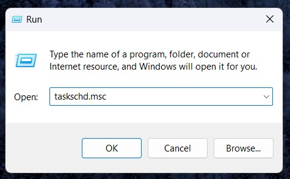
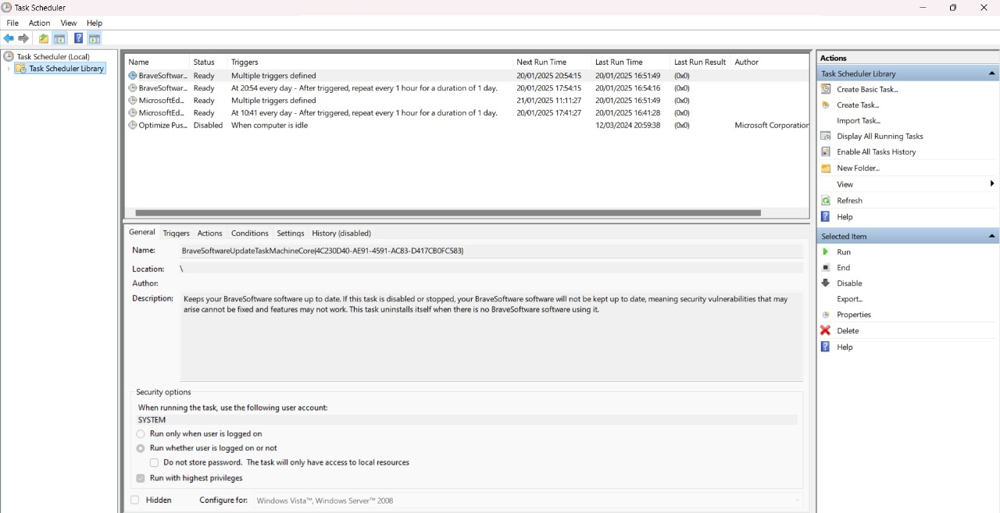
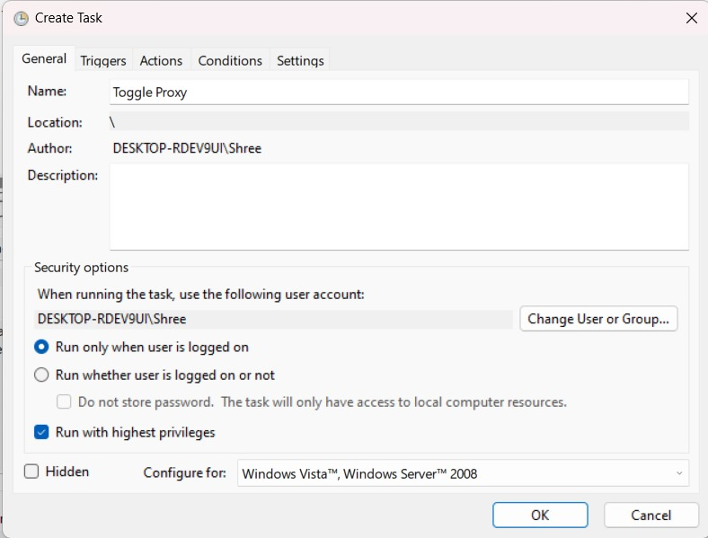
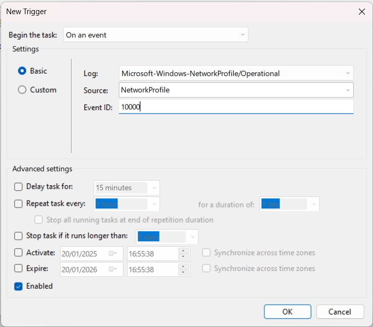
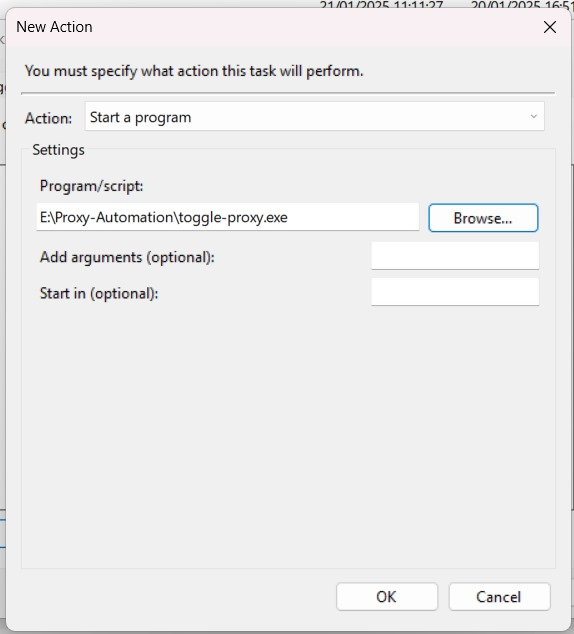
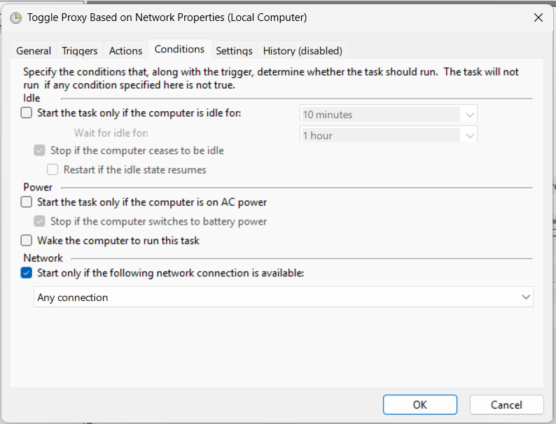

# Proxy-Automation

This is a simple automation script to automate the process of setting up a proxy server on your machine. Currently, it only tackles the setup of a proxy server on a Windows machine. The script is written in PowerShell and is very easy to use. 

Based on contributions and popularity, I will be adding support for other operating systems as well.

## Features

> [!NOTE]
> This script just toggles proxy so it doesn't require credential access. This also means you need to have the proxy settings configured in your system and the applications you want to toggle proxy for once.

This toggles proxy of following applications:

1. System Proxy (through Registry)
2. Git (through `.gitconfig`)
3. NPM (through `.npmrc`)
4. VS Code (through `settings.json`)

... More to add based on contributions/suggestions.

## Installation

> [!NOTE]
> ### **This script needs to be run in Administrator mode.**
> ALso, it's recommended to save your `proxyUser` and `proxyPass` in Registry for secure access. You can do this by running the following command in PowerShell:
>
>    ```powershell
>    $proxyUser = 'your-username' # Replace with your username
>    $proxyPass = 'your-password' # Replace with your password
>    Set-ItemProperty 'HKCU:\Software\Microsoft\Windows\CurrentVersion\Internet Settings' -Name ProxyUser -Value  $proxyUser
>    Set-ItemProperty 'HKCU:\Software\Microsoft\Windows\CurrentVersion\Internet Settings' -Name ProxyPass -Value  $proxyPass
>    ```

1. Clone the repository to your local machine

    ```bash
    git clone https://github.com/bhupesh98/Proxy-Automation.git && cd Proxy-Automation
    ```

> [!NOTE]
> You need to run these commands in PowerShell 5 or above in Administrator mode (Installation of [Powershell 7](https://learn.microsoft.com/en-us/powershell/scripting/install/installing-powershell-on-windows?view=powershell-7.4) Latest release is recommended for features).
> 
> **OR**
> 
> You can download the executable directly from the [releases](https://github.com/bhupesh98/Proxy-Automation/releases/latest) section.Use the following powershell command to download it:
> 
> ```powershell
> Invoke-WebRequest -Uri 'https://github.com/bhupesh98/Proxy-Automation/releases/download/v1.1.0/toggle-proxy.exe' -OutFile 'toggle-proxy.exe'
> ```
> Now, skip to step 4.

2. **[Only for Contributors]** To make this script as an executable, you need to install the `ps2exe` module. You can install it using the following command:

    ```powershell
    Install-Module ps2exe
    ```

3. **[Only for Contributors]** To convert the script to an executable, run the following command:

    ```powershell
    Invoke-PS2EXE .\ToggleProxy.ps1 .\toggle-proxy.exe
    ```

4. Now, you can run the `toggle-proxy.exe` file to toggle the proxy settings on your machine. This needs to be configured in task scheduler to run when you connect to a network. Following are the steps with images to help you set things up:

    - Press `Win + R` and type `taskschd.msc` to open Task Scheduler.

        
    
    - Click on `Create Task` on the right side of the window.

        

    - Fill in the details as shown in the image below. Make sure to check the `Run with highest privileges` checkbox.

        

    - Click on the `Triggers` tab and then click on `New`. Fill in the details as shown in the image below. Click on `OK`.

        

    - Click on the `Actions` tab and then click on `New`. Browse the `toggle-proxy.exe` file. Click on `OK`.

        

    - Click on the `Conditions` tab and uncheck the `Start the task only if the computer is on AC power` checkbox and check the `Start Only if the following network connection is available` checkbox. Keep the `Any connection` option selected. Click on `OK`.

        

5. You are all set. The script will run every time you connect to a network.

## Contributions

Contributions are welcome. Feel free to open an issue or a pull request.

## License

This project is licensed under the MIT License - see the [LICENSE](LICENSE) file for details.
